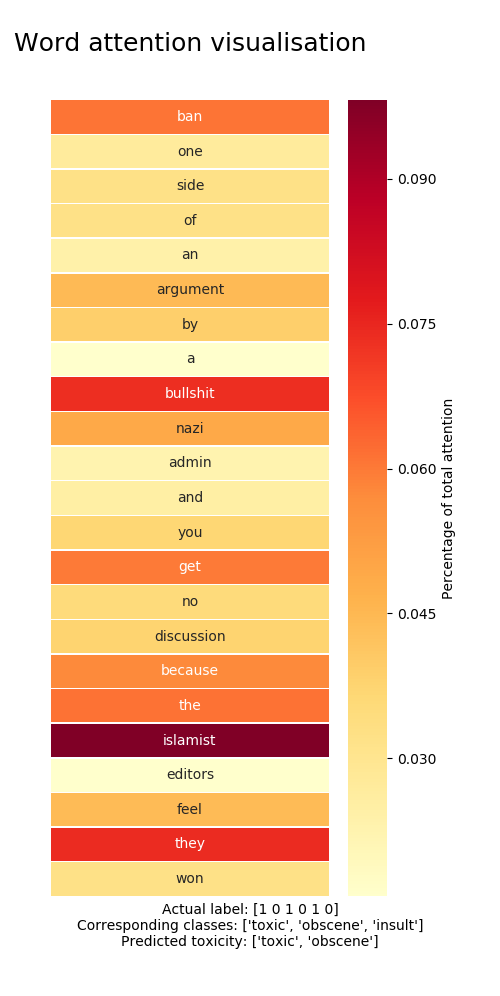
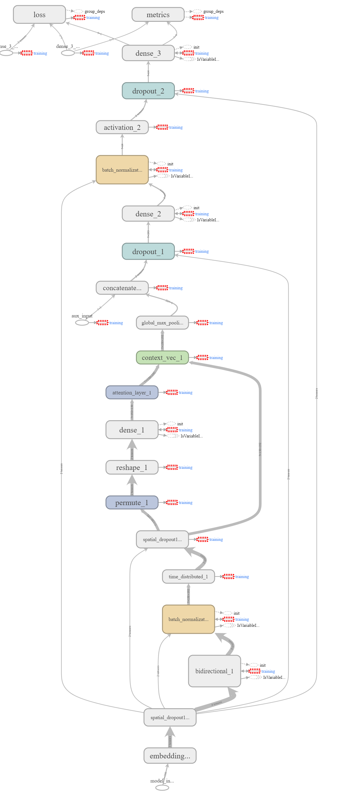

# ToxicComments - Classification of Wikipedia comments content


This repo contains scripts for the Jigsaw Toxic Comment Classification competition hosted on Kaggle. It contains a GRU-based neural attention model for classifying comment content based on six different types of toxicity. The model is primarily implemented in Keras, using methods from sklearn for preprocessing.

## Getting started
### Prerequisites
To make model training efficient, it has been implemented using Keras CuDNNGRU layer, meaning that is can be only be run out-of-the-box on a GPU. Required packages are
```
Python 3+
Tensorflow-gpu 1.5
Keras 2.0
Numpy & SciPy
Pandas
Seaborn & Matplotlib
```
In addition, gpu-support requires that CUDA 9.1 and cuDNN 7 have been installed and configured.

### Get training and test data
The first step to using this repo is to get some data to train and test on. The easiest data to work with is the original competition data, which can be  found at https://www.kaggle.com/c/jigsaw-toxic-comment-classification-challenge/data. This data should be placed in a folder named "data". The sample submission should also be downloaded if submissions are to be made. In addition, to use auxilliary input to the model additional data should be downloaded from https://figshare.com/articles/Wikipedia_Talk_Labels_Toxicity/4563973 and also placed in the data folder.

### Getting GloVe vectors
To use GloVe embedding vectors, download the 840B Common Crawl GloVe-vectors from https://nlp.stanford.edu/projects/glove/ (2GB download, 5GB file size) and extract them into the data folder.

### Making fasttext vectors
To make your own fasttext embeddings, get the fasttext python library and run make_fasttext_embeddings.py with your choice of settings. Keeping the embedding dimension at 300 is recommended for performance, although this does make the filesize much larger. Consider reducing if memory is an issue.

### Creating auxilliary inputs
Auxilliary inputs are outputs from a ridge regression model trained on figshare data and allowed to predict on the original data. These inputs obviously require that the figshare data has been downloaded, after which you simply run the 'feature_engineering.py' script as is.

## Running
The main script is run using a number of command line flags to set runtime options.
```
--auxilliary_input (-a) toggles using auxilliary input. Requires that these inputs have been made, see "Creating auxilliary inputs" above.
--combine_data (-c) toggles whether training and test data are combined when tokenizing the input comments.
--fasttext (-f) toggles whether fasttext embeddings are used instead of GloVe embeddings.
--submit (-s) toggles whether data should be saved in a submission file.
--train (-t) toggles (re)-training of the model. Exclude this when for instance making a prediction from saved model weights.
--visualize (-v) toggles visualisation of attention.
```
Most hyperparameters such as learning rate, hidden units etc. are hardcoded into the model. This may be changed at a later time, but for now such changes to the model needs to be done inside the ToxicClassifier code. Likewise, training parameters such as the number of epochs, batch size etc. also need to be changed manually in the main script.

## About the model


As mentioned earlier, the model is based on a neural network architecture using an attention GRU. Input embeddings are fed into a (poissibly stacked) bidirectional GRU unit with tanh-activation, after which they are passed to an attention layer whose task it is to learn which parts of the inputs the model should focus on.

Attention outputs are then max pooled globaly and the result passed to a (possibly number of) dense layers, until a sigmoid output layer gives the final class predictions. The dense layer nonlinearity is ELU rather than ReLU, after it was seen that these performed better empirically. 

Inbetween most layers of the model, (spatial) dropout with a probability 0.4 is performed, together with batch normalization. The high dropout rate helps alleviate overfitting, which otherwise tends to occurr rather quickly, especially if the model is made more complex through the use of additional layers.